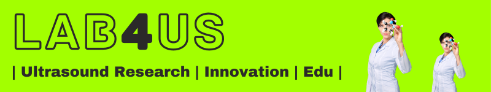

# Short-course DSP-GPU @ TIB PAN (May 2023)

This is a repository for the Digital Signal Processing with GPUs — Introduction to Parallel Programming” short-course.

[TIB PAN](https://tib.ippt.pan.pl/) - Doctoral School
Information and Biomedical Technologies, Polish Academy of Sciences

*This short-course is a part of the [Lab4US.eu](https://lab4us.eu) initiative*

